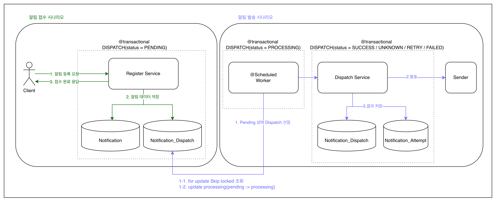
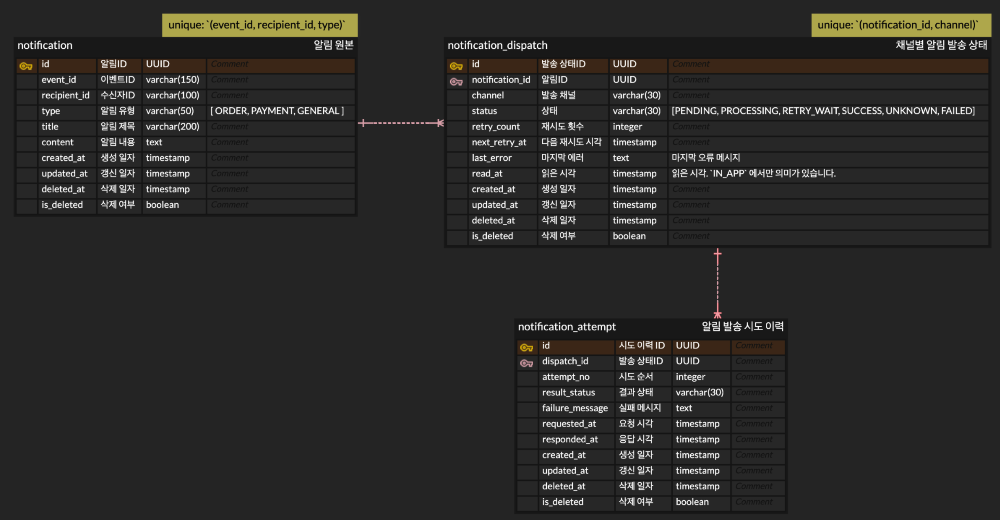
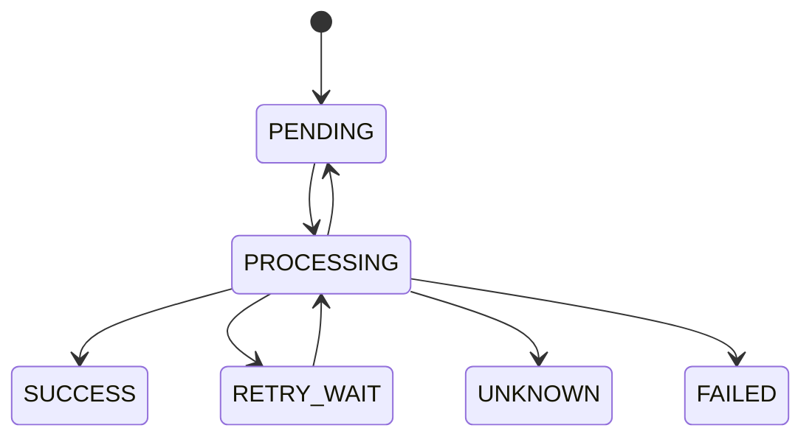

# Notification System

## 프로젝트 개요

`notification`, `notification_dispatch`, `notification_attempt` 3개 모델로 구성한 Spring Boot 알림 시스템입니다.

각 모델의 책임은 아래와 같습니다.

- `notification`: 알림 원본입니다. 어떤 이벤트로, 누구에게, 어떤 제목과 본문을 보여줄지 저장합니다.
- `notification_dispatch`: 채널별 발송 상태입니다. `EMAIL`, `IN_APP` 별로 현재 상태, 재시도 횟수, 다음 재시도 시각, 마지막 오류를 관리합니다.
  - 실제 외부 발송 시작 여부를 구분하기 위한 내부 마커 `sendStartedAt` 도 함께 관리합니다.
- `notification_attempt`: 개별 발송 시도 이력입니다. 한 번의 발송 시도가 성공했는지, 실패했는지, timeout 이었는지와 요청/응답 시각을 기록합니다.

## 아키텍처 스타일

이 프로젝트는 `헥사고널 스타일`로 설계했습니다.

```text
src
└── main
    └── java/com/notification/mid
        ├── common
        │   ├── exception      # 공통 예외, 에러 코드
        │   └── time           # TimeProvider 같은 공통 기술 추상화
        └── notification
            ├── presentation    # HTTP controller, request/response DTO
            │                   # 바깥 입력 어댑터 역할
            ├── application
            │   ├── port
            │   │   ├── in      # 등록, 조회, 발송, recovery 유스케이스 진입점
            │   │   └── out     # 외부 의존 계약
            │   ├── service
            │   │   └── impl    # 유스케이스 구현체
            │   ├── processor   # 발송 결과 후처리, attempt 기록, 상태 반영
            │   ├── policy      # 재시도 정책 같은 규칙
            │   ├── dto         # 유스케이스 전달 모델
            │           
            ├── domain
            │   ├── notification # 알림 원본 엔티티와 타입
            │   ├── dispatch     # 채널별 발송 엔티티와 상태
            │   ├── attempt      # 발송 시도 이력과 결과
            │   └── shared       # BaseEntity 같은 공통 도메인 요소
            │            
            └── infrastructure  # 기술 구현
                ├── repository  # Spring Data JPA + port adapter
                ├── client      # MockNotificationSender
                └── scheduler   # worker, recovery 스케줄러
                                # application port/in을 호출하는 어댑터
```

적용한 부분:

- `presentation -> application -> domain` 흐름으로 유스케이스를 배치했습니다.
- inbound 유스케이스 인터페이스는 `application/port/in`, outbound 계약은 `application/port/out` 으로 분리했습니다.
- `application` 이 `infrastructure` 구현체를 직접 모르도록 outbound port를 뒀습니다.
- `infrastructure` 는 DB, sender, scheduler 같은 기술 구현만 맡도록 분리했습니다.


### 프로젝트 기본 흐름 (간략화)

- 등록 API는 `notification` 과 `notification_dispatch` 를 저장합니다.
- 실제 발송은 스케줄러 worker가 비동기로 처리합니다.
- 발송 결과는 `notification_dispatch` 상태와 `notification_attempt` 이력으로 남깁니다.
- 오래 머문 `PROCESSING` 건은 recovery 스케줄러가 회수합니다.
  - 아직 외부 발송을 시작하지 못한 건은 `PENDING`으로 재큐잉합니다.
  - 이미 외부 발송을 시작한 건은 `UNKNOWN`으로 격리합니다.

현재 지원 채널은 `EMAIL`, `IN_APP` 입니다.

## 기술 스택

| 구분 | 내용 |
| --- | --- |
| Language | Java 25 |
| Framework | Spring Boot 4.0.5 |
| Web | Spring MVC |
| Validation | Jakarta Validation, `spring-boot-starter-validation` |
| Persistence | Spring Data JPA |
| Database | H2 file-based (default), `MODE=PostgreSQL` |
| Scheduler | `@EnableScheduling`, `@Scheduled` |
| Build | Gradle Wrapper |
| Test | JUnit 5, Spring Boot Test, MockMvc |

## 실행 방법

1. 애플리케이션 실행

```bash
./gradlew bootRun
```

2. 기본 접속 주소

```text
http://localhost:8080
```

3. 기본 설정

- 기본 실행은 파일 기반 H2를 사용합니다. DB 파일은 `./data/notification` 경로에 생성됩니다.
- 서버를 재시작해도 데이터가 유지됩니다. `spring.jpa.hibernate.ddl-auto=update`
- 이 설정은 로컬 재시작 내구성 확인용입니다. 기존 `./data/notification` 파일을 재사용한 채 enum/컬럼 이름을 바꾸면 `ddl-auto=update`만으로는 안전하게 정리되지 않을 수 있습니다.
- 스키마를 바꾸는 개발 중에는 필요 시 로컬 H2 파일을 삭제하고 다시 생성해야 할 수 있습니다. 운영 환경에서는 PostgreSQL + 명시적 migration 도구를 전제로 보는 편이 안전합니다.
- `application.yml` 에서 `application-scheduler.yml` 을 import 합니다.
- H2 console 은 활성화되어 있습니다.

## API 목록 및 예시

모든 응답은 아래 공통 래퍼를 사용합니다.

```json
{
  "success": true,
  "code": "SUCCESS",
  "message": "OK",
  "data": {}
}
```

| Method | Path | 설명 |
| --- | --- | --- |
| `POST` | `/api/v1/notifications` | 알림 등록 |
| `GET` | `/api/v1/notifications/{notificationId}` | 특정 알림 요청의 현재 상태 조회 |
| `GET` | `/api/v1/users/{recipientId}/notifications` | 사용자용 IN_APP 알림 목록 조회 |
| `GET` | `/api/v1/admin/users/{recipientId}/notifications` | 관리자용 알림 상세 목록 조회 |

<details>
<summary>{알림 발송 등록} / [POST] /api/v1/notifications</summary>

```http
POST /api/v1/notifications
Content-Type: application/json
```

```json
{
  "eventId": "order-paid-10001",
  "recipientId": "user-1",
  "type": "ORDER",
  "channel": "EMAIL",
  "title": "주문 결제가 완료되었습니다",
  "content": "주문번호 10001의 결제가 완료되었습니다."
}
```

```json
{
  "success": true,
  "code": "SUCCESS",
  "message": "OK",
  "data": {
    "notificationId": "01967d2f-6a52-7d3b-a7d1-3d1b2c5e9f10",
    "dispatchId": "01967d2f-6a53-7c42-9a21-85e77e014201",
    "eventId": "order-paid-10001",
    "recipientId": "user-1",
    "type": "ORDER",
    "channel": "EMAIL",
    "status": "PENDING",
    "retryCount": 0,
    "nextRetryAt": null,
    "createdAt": "2026-04-27T10:00:00"
  }
}
```

유효성 규칙:

- `eventId`: 필수, 최대 150자
- `recipientId`: 필수, 최대 100자
- `type`: 필수, `ORDER | PAYMENT | GENERAL`
- `channel`: 필수, `EMAIL | IN_APP`
- `title`: 필수, 최대 200자
- `content`: 필수, 최대 1000자

수동 확인용 `eventId` 규칙:

- 일반 성공: 임의 값
- `fail-...`: 재시도 가능한 실패를 발생시켜 `RETRY_WAIT` 또는 재시도 소진 후 `FAILED` 흐름을 확인할 수 있습니다.
- `permanent-fail-...`: 재시도 불가능한 실패를 발생시켜 즉시 `FAILED` 흐름을 확인할 수 있습니다.
- `timeout-...`: 현재 Mock sender는 channel과 무관하게 `eventId`가 `timeout-` 접두어이면 timeout 예외를 발생시켜 `UNKNOWN` 흐름을 확인할 수 있습니다.

</details>

<details>
<summary>{특정 알림 요청의 현재 상태 조회} / [GET] /api/v1/notifications/{notificationId}</summary>

```http
GET /api/v1/notifications/01967d2f-6a52-7d3b-a7d1-3d1b2c5e9f10
```

- 상세 응답의 `dispatches[].attempts` 에 발송 시도 이력이 포함됩니다.

```json
{
  "success": true,
  "code": "SUCCESS",
  "message": "OK",
  "data": {
    "notificationId": "01967d2f-6a52-7d3b-a7d1-3d1b2c5e9f10",
    "eventId": "order-paid-10001",
    "recipientId": "user-1",
    "type": "ORDER",
    "title": "주문 결제가 완료되었습니다",
    "content": "주문번호 10001의 결제가 완료되었습니다.",
    "createdAt": "2026-04-27T10:00:00",
    "updatedAt": "2026-04-27T10:00:00",
    "dispatches": [
      {
        "dispatchId": "01967d2f-6a53-7c42-9a21-85e77e014201",
        "channel": "EMAIL",
        "status": "PENDING",
        "retryCount": 0,
        "nextRetryAt": null,
        "lastError": null,
        "readStatus": "UNKNOWN",
        "readAt": null,
        "createdAt": "2026-04-27T10:00:00",
        "updatedAt": "2026-04-27T10:00:00",
        "attempts": []
      }
    ]
  }
}
```

</details>

<details>
<summary>{사용자 알림 목록 조회} / [GET] /api/v1/users/{recipientId}/notifications</summary>

```http
GET /api/v1/users/user-1/notifications?size=20&readStatus=UNREAD
```

조회 규칙:

- 기본 정렬: `createdAt desc`, `id desc`
- 기본 `size`: 20
- 최대 `size`: 100
- `cursor`: 이전 응답의 `nextCursor` 값. 없으면 첫 페이지부터 조회합니다.
- 사용자용 조회는 `IN_APP` 채널의 발송 완료(`SUCCESS`) 알림만 대상으로 합니다.
- `readStatus`: `READ | UNREAD`
- `readStatus=UNKNOWN` 은 잘못된 요청입니다.
- 응답의 `content[]` 는 notification 단위의 경량 정보만 반환합니다.

```json
{
  "success": true,
  "code": "SUCCESS",
  "message": "OK",
  "data": {
    "content": [
      {
        "notificationId": "01967d2f-6a60-70c1-b02b-087fa31d4411",
        "eventId": "event-2",
        "type": "ORDER",
        "title": "주문 결제가 완료되었습니다",
        "createdAt": "2026-04-27T10:05:00"
      }
    ],
    "size": 20,
    "hasNext": false,
    "nextCursor": null
  }
}
```

</details>

<details>
<summary>{관리자 알림 목록 조회} / [GET] /api/v1/admin/users/{recipientId}/notifications</summary>

```http
GET /api/v1/admin/users/user-1/notifications?size=20&channel=IN_APP&readStatus=UNREAD
```

조회 규칙:

- 기본 정렬: `createdAt desc`, `id desc`
- 기본 `size`: 20
- 최대 `size`: 100
- `cursor`: 이전 응답의 `nextCursor` 값. 없으면 첫 페이지부터 조회합니다.
- `channel`: `EMAIL | IN_APP`
- `readStatus`: `READ | UNREAD`
- `readStatus` 는 `channel=IN_APP` 와 함께 사용할 때만 유효합니다.
- 응답의 `content[].dispatches` 는 필터 조건에 맞는 dispatch 만 포함합니다.

```json
{
  "success": true,
  "code": "SUCCESS",
  "message": "OK",
  "data": {
    "content": [
      {
        "notificationId": "01967d2f-6a60-70c1-b02b-087fa31d4411",
        "eventId": "event-2",
        "type": "ORDER",
        "title": "주문 결제가 완료되었습니다",
        "createdAt": "2026-04-27T10:05:00",
        "dispatches": [
          {
            "dispatchId": "01967d2f-6a61-73aa-9f4c-10e5a0eb2201",
            "channel": "IN_APP",
            "status": "SUCCESS",
            "retryCount": 0,
            "nextRetryAt": null,
            "lastError": null,
            "readStatus": "UNREAD",
            "readAt": null,
            "createdAt": "2026-04-27T10:05:00",
            "updatedAt": "2026-04-27T10:05:00"
          }
        ]
      }
    ],
    "size": 20,
    "hasNext": false,
    "nextCursor": null
  }
}
```

</details>

대표 오류 응답:

- `400 INVALID_REQUEST`: 요청 유효성 제약 실패
- `409 DUPLICATE_NOTIFICATION_REQUEST`: 같은 알림 원본에 같은 채널을 다시 등록한 경우
- `409 IDEMPOTENCY_PAYLOAD_MISMATCH`: 같은 멱등성 키에 다른 제목/본문을 보낸 경우
- `404 NOTIFICATION_NOT_FOUND`: 없는 `notificationId` 조회
- `500 INTERNAL_ERROR`: 처리되지 않은 예외

## 데이터 모델 설명


- notification : 알림 원본을 관리하는 테이블입니다.
- notification_dispatch : 발송 상태를 관리하는 테이블입니다.
  - 최초 저장시 PENDING 상태
  - worker 선점 시 PROCESSING 상태
  - 발송 후 결과에 따라 SUCCESS / UNKNOWN / RETRY_WAIT / FAILED 상태
  - 내부적으로 `sendStartedAt` 을 사용해 claim만 완료된 PROCESSING과 실제 외부 호출에 들어간 PROCESSING을 구분
- notification_attempt : 알림의 발송 이력입니다.
  - N회 발송시 N개 생성, 각 요청이 성공 했는지 어떤 이유로 실패했는지 관리합니다.
## 상태 모델

- 발송 워커(Dispatch Worker)는 `PENDING` 또는 재시도 시각이 지난 `RETRY_WAIT` 를 조회하여 `PROCESSING` 으로 전이합니다.
- 복구 지점은 오랫동안 PROCESSING 인 알림 대상으로 진행합니다. (이하 stale PROCESSING)
- stale `PROCESSING` 중 외부 발송을 아직 시작하지 못한 건은 `PENDING` 으로 되돌려 자동 재처리합니다.
- `UNKNOWN`(timeout 또는 외부 발송 시작 후 stale `PROCESSING` 복구) / `FAILED`(최종 실패)는 운영 관리 대상입니다.

## 요구사항 해석 및 가정

- 알림 등록 한 번에 채널 하나만 가능하고, 같은 멱등키로 여러 채널에 전송할 수 있다고 가정했습니다. 
- 동일한 알림 정의 : (eventId, recipientId, type, channel)이 같다면 같은 알림입니다. 
  - 멱등성 기준의 1차 키는 `(eventId, recipientId, type)` 입니다. 이 조합이 같고 다른 채널에 발송한다면 `notification` 을 재사용하여 새 `dispatch` 를 추가합니다.
  - 기존 멱등성 키를 재사용할 때 `title`, `content` 가 기존 payload와 다르면 `409 IDEMPOTENCY_PAYLOAD_MISMATCH` 를 반환합니다.
    - IN_APP 발송 후 `title`, `content`가 수정 된 뒤 EMAIL로 발송되는 경우를 막기 위해서입니다.
- 요구사항의 “참조 데이터”는 이번 제출에서 `eventId` 하나를 대표 참조키로 단순화했습니다.
  - `lectureId`, `paymentId`, 임의 metadata payload까지 일반화하지는 않았습니다.
  - 확장 시에는 `referenceType`, `referenceId`, `referencePayload(JSON)` 구조로 분리하고, 멱등성 키 정책도 함께 재정의할 계획입니다.
- 사용자 목록 조회의 단위는 `dispatch` 가 아니라 `notification` 입니다. 응답은 cursor 기반이며 `IN_APP + SUCCESS` 알림만 경량 정보로 노출합니다.
- 관리자 목록 조회도 `notification` 단위이며, 각 `content[].dispatches` 배열에는 조회 조건에 맞는 dispatch 만 남습니다.
- 사용자 목록 조회의 `readStatus(읽음 여부)` 는 `READ | UNREAD` 만 허용됩니다.
- 관리자 목록 조회의 `readStatus(읽음 여부)` 필터는 `channel=IN_APP` 와 함께 사용할 때만 유효합니다. `channel=EMAIL` + `readStatus` 요청시 예외를 반환합니다.
- 현재 timeout 시나리오는 `MockNotificationSender` 가 channel과 무관하게 `eventId`가 `timeout-` 접두어인 경우 만듭니다. (임시)

## 설계 결정과 이유

### 모델링

- 메시지 원본과 채널별 발송 상태를 분리하기 위해 `notification` 과 `notification_dispatch` 를 나눴습니다. 같은 알림 원본에 여러 채널을 붙일 수 있습니다.
- 시도 이력을 잃지 않기 위해 `notification_attempt` 를 별도 테이블로 분리했습니다. 현재 상태와 과거 시도를 함께 볼 수 있고, 상세 조회에서 시도 이력을 함께 내려줍니다.

### 중복 방지와 동시성

- 중복 요청은 애플리케이션 사전 조회와 DB unique 제약을 함께 사용합니다. 동시 요청에서도 한 건만 생성되도록 맞췄습니다.
- worker 선점은 `FOR UPDATE SKIP LOCKED` 로 처리합니다. 여러 worker 가 동시에 돌아도 같은 `dispatch` 를 함께 집지 않습니다.
- worker 는 `batch-size` 만큼 한 번에 `PROCESSING` 으로 바꾸지 않고, 1건씩 선점 후 바로 발송합니다. 아직 실제 발송을 시작하지 않은 건이 오래된 `PROCESSING` 으로 오인되는 위험을 줄이기 위한 선택입니다.
- worker 는 외부 발송 직전에 `sendStartedAt` 을 별도 커밋으로 기록합니다. recovery는 이 값을 보고 “선점만 완료된 건”과 “이미 외부 호출을 시작한 건”을 구분합니다.
- worker와 recovery는 서로 다른 `ThreadPoolTaskScheduler` 를 사용합니다. 단일 인스턴스에서도 발송이 오래 block됐을 때 recovery 스케줄러가 같이 멈추지 않도록 분리했습니다.
- recovery 선점도 `FOR UPDATE SKIP LOCKED` 로 처리합니다. 여러 recovery 인스턴스가 동시에 돌아도 같은 stale `PROCESSING` 을 중복 복구하지 않습니다.
- 발송 결과 반영은 `where status = 'PROCESSING'` 조건부 update 로 처리합니다. recovery 가 먼저 상태를 바꿨다면 뒤늦은 worker 커밋이 최종 상태를 덮어쓰지 않습니다.

### 실패 처리와 복구

- 재시도 가능한 실패만 retry policy를 탑니다. 현재는 `RetryableNotificationSendException` 으로 분류된 예외만 `RETRY_WAIT` 대상입니다.
- 재시도 불가능한 실패(`NonRetryableNotificationSendException`)와 예상치 못한 예외는 즉시 `FAILED` 로 종료합니다.
- timeout 건을 즉시 재시도하지 않고 `UNKNOWN` 으로 끝냅니다. 외부 채널에서 이미 발송됐을 가능성을 보수적으로 다루기 위한 선택입니다.
- 오래된 `PROCESSING` 건은 두 갈래로 복구합니다.
  - `sendStartedAt` 이 없는 건은 아직 외부 발송을 시작하지 못한 것으로 보고 `PENDING` 으로 되돌립니다.
  - `sendStartedAt` 이 있는 건은 결과를 확정할 수 없으므로 `UNKNOWN` 으로 격리합니다.
- 발송 시도 이력(`notification_attempt`)은 최종 상태 CAS가 성공한 뒤에만 저장합니다. recovery와 경합했을 때 `dispatch.status` 와 `attempt` 결과가 어긋나는 것을 막기 위한 선택입니다.

### 테스트 가능성

- 시간 조회를 `TimeProvider` 로 분리했습니다. 테스트에서 시점 제어가 쉬워지고 상태 전이 검증이 단순해집니다.

## 테스트 실행 방법

테스트 실행:

```bash
./gradlew test
```

테스트 프로필 동작:

- `src/test/resources/application-test.yml` 을 사용합니다.
- 테스트는 H2 메모리 DB를 사용합니다.
- scheduling 은 비활성화됩니다.

현재 포함된 테스트:

- `NotificationApplicationTests`: 스프링 컨텍스트 로드
- `NotificationTest`: 알림 원본 생성
- `NotificationAttemptTest`: 발송 시도 이력 생성
- `NotificationDispatchTest`: 상태 전이, 읽음 상태 계산
- `NotificationWorkerTest`: worker의 1건 선점 후 즉시 처리 반복
- `NotificationDispatchOutcomeProcessorTest`: 성공/실패/timeout/recovery 후처리
- `NotificationRegistrationServiceImplTest`: notification unique 충돌 fallback의 payload 재검증
- `NotificationRegistrationServiceConcurrencyIntegrationTest`: 중복 요청과 payload mismatch의 동시성 보장
- `GlobalExceptionHandlerTest`: 예외 응답 포맷
- `NotificationWebControllerIntegrationTest`: 등록, 상세 조회, 목록 조회, 필터 검증
- `NotificationDispatchServiceIntegrationTest`: 성공, 실패, timeout, 재시도 종료
- `NotificationRecoveryServiceIntegrationTest`: stale `PROCESSING` 복구


## 미구현 제약 사항
- Mock(알림 채널) API가 멱등성 키 또는 발송 상태 조회 기능을 제공하지 않는다고 가정했습니다.
  - 따라서 `UNKNOWN` 은 자동 재시도 대상이 아니라 운영 확인이 필요한 격리 상태로 관리합니다.
  - 현재 정책은 `UNKNOWN` 발생 시 로그로 노출하고, 운영자가 상태 조회 응답과 attempt 이력을 확인한 뒤 필요 시 중복 가능성을 인지하고 수동 재발행하는 방식입니다.
  - 자동 재시도를 하지 않는 이유는 외부 채널 발송이 이미 성공했을 가능성을 배제할 수 없기 때문입니다.
  - 향후 알림 채널 API가 멱등성 키를 지원하면 `UNKNOWN` 재시도 API 또는 자동 재시도를 검토할 수 있습니다.
  - 향후 알림 채널 API가 상태 조회를 지원하면 발송 내역 확인 후 `SUCCESS` / `RETRY_WAIT` / `FAILED` 로 자동 결정할 수 있습니다.
  
- 알림 채널 CircuitBreaker 미구현
  - 알림 채널에 장애가 발생한다면 모든 알림 발송이 불필요하게 재시도 되고 최종 실패로 전이합니다.
  - Mock(알림 채널) API가 로그로 대체 되어 적용하지 않았습니다.
- DB 아카이브 이관 미구현
  - 알림이 지속될 수록 데이터가 쌓여 부하가 발생할 수 있습니다.
  - 일주일, 하루 단위 등으로 데이터를 이관해야 하지만 과제 단순성을 위해 미구현 했습니다.
- 중복 여부 Redis 미구현
  - 알림 중복 여부를 조회할 때 Redis를 사용하여 빠르게 검증하고 차단할 수 있습니다
  - 알림 중복이 얼마나 발생하고 가용 가능한 레디스 크기가 얼마인지 알 수 없어 도입하지 않았습니다.
- Outbox 미구현
  - 현재 DB polling 구조에서는 notification_dispatch가 queue 역할을 하므로 별도 outbox를 구현하지 않았습니다.
  - 메시지 브로커 전환시 `알림 접수 API`에서 outbox 저장을 추가해야 합니다.
  
## AI 사용 범위
- 코드 초안 (리뷰 수행)
- 문서 초안 (리뷰 수행)

## 메시징 브로커 도입 시 수정 포인트
###  전환 순서

1. `build.gradle` 에 broker 의존성 추가
2. 등록 API에서 outbox까지 저장
3. outbox publisher 추가
4. broker consumer 추가 `notificationDispatchService.dispatch(NotificationDispatchTargetDto payload)` 호출
5. `NotificationWorker` 제거

이렇게 바꾸면 현재의 상태 모델과 재시도 정책은 유지하면서, 비동기 전달 수단만 DB polling 에서 메시징 브로커로 교체할 수 있습니다.

## 추가 문서 

| 문서 주제 | 링크 | 비고 (주요 키워드) |
|----------|------|------------------|
| 요구사항 해석 및 개선 의견 | [바로가기](docs/requirements-interpretation-and-improvement-notes.md) | 요구사항 해석, 중복 방지, 상태 설계, 개선 방향 |
| 비동기 처리 구조 및 재시도 정책 | [바로가기](docs/async-processing-and-retry-policy.md) | 비동기 처리, 상태 전이, retry, UNKNOWN, DB polling |
| 사용자 알림 조회 성능 개선 | [바로가기](docs/user-get-notification-improve.md) | cursor pagination, 인덱스, 성능 측정, 조회 최적화 |
