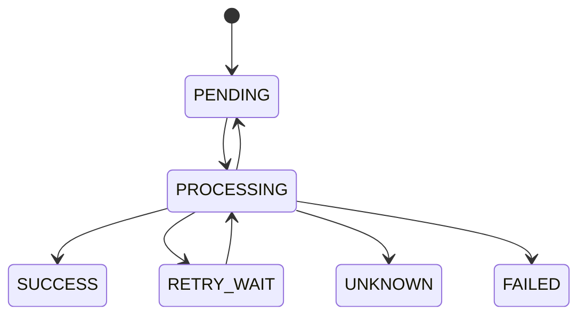

# 비동기 처리 구조 및 재시도 정책

## 1. 설계 의도

- 알림 발송은 수강 신청, 결제 확정, 강의 시작 안내 같은 비즈니스 이벤트 이후에 수행되는 후속 작업입니다.
- 따라서 알림 발송 실패가 원래 비즈니스 트랜잭션에 영향을 주면 안 됩니다.  
- 하지만 실패를 단순히 무시하면 운영자가 문제를 추적하거나 재처리할 수 없습니다.

그래서 현재 구현은 다음 방향으로 설계했습니다.

- API 요청 스레드는 알림 요청 등록까지만 수행합니다.
- 실제 발송은 별도 worker가 비동기로 처리합니다.
- 발송 상태, 실패 사유, 재시도 횟수는 DB에 기록합니다.
- 동일 이벤트에 대한 중복 알림 생성을 방지합니다.
- worker 장애나 서버 재시작 후에도 DB에 남은 데이터를 기준으로 재처리할 수 있게 합니다.

현재 구조는 실제 메시지 브로커를 사용하지 않고 DB polling 방식으로 구현되어 있습니다.  
다만 `Outbox`+`MQ-producer-consumer`만 추가하면 전환할 수 있도록 구성 했습니다.

---

## 2. 전체 처리 흐름

전체 흐름은 크게 등록 단계와 발송 단계로 나뉩니다.

```text
알림 요청 API
  -> notification 저장
  -> notification_dispatch 저장(PENDING)
  -> 201 Created 즉시 응답

worker
  -> PENDING 또는 재시도 시각이 지난 RETRY_WAIT 조회
  -> 1건을 PROCESSING 상태로 선점
  -> 외부 호출 직전 sendStartedAt 기록
  -> Mock sender 호출
  -> NotificationDispatchOutcomeProcessor 가 발송 결과를 후처리
  -> notification_attempt 기록
  -> SUCCESS / RETRY_WAIT / UNKNOWN / FAILED 로 상태 변경
````

API 요청 단계에서는 실제 외부 발송을 수행하지 않습니다.
대신 알림 원본과 채널별 발송 대상을 DB에 저장한 뒤 즉시 응답합니다.

실제 발송은 worker가 주기적으로 DB를 조회하면서 처리합니다.
이때 `notification_dispatch` row가 DB 기반 큐 역할을 합니다.
한 번의 poll에서 최대 `batch-size` 건을 처리하되, dispatch는 1건씩 선점 후 바로 발송합니다.

---

## 3. 상태 정의와 전이

알림 발송 단위인 `notification_dispatch` 는 다음 상태를 가집니다.

| 상태                 | 의미                                        |
| ------------------ | ----------------------------------------- |
| `PENDING`          | 발송 대기 상태                                  |
| `PROCESSING`       | worker가 선점하여 처리 중인 상태                     |
| `RETRY_WAIT`       | 실패 후 재시도 시각까지 대기 중인 상태                    |
| `SUCCESS`          | 발송 성공 상태                                  |
| `UNKNOWN`          | timeout 또는 worker 비정상 종료로 결과를 확정할 수 없는 상태 |
| `FAILED`           | 재시도 횟수를 모두 소진한 최종 실패 상태                   |

허용되는 상태 전이는 다음과 같습니다.



`SUCCESS`, `UNKNOWN`, `FAILED` 는 종결 상태로 봅니다.
따라서 worker가 다시 자동으로 `PROCESSING` 상태로 변경하지 않습니다.

`UNKNOWN` 을 종결 상태로 둔 이유는 결과가 불확실한 알림을 자동 재시도할 경우 중복 발송 위험이 있기 때문입니다.
반면, 아직 외부 발송을 시작하지 못한 stale `PROCESSING` 은 `PENDING` 으로 되돌려 다시 처리할 수 있게 합니다.

---

## 4. 재시도 정책

발송 실패는 재시도 가능한 실패, 재시도 불가능한 실패, timeout으로 구분합니다.

### 4.1 재시도 가능한 실패

외부 서버 오류, 일시적인 네트워크 장애처럼 재시도할 수 있는 예외는 재시도 가능한 실패로 처리합니다.

일반 실패가 발생하면 상태 반영이 성공한 뒤 다음 정보를 기록합니다.

* `notification_attempt.resultStatus = FAILURE`
* `notification_attempt.failureMessage = 예외 메시지`
* `notification_dispatch.lastError = 예외 메시지`

재시도 정책은 다음과 같습니다.

| 다음 retryCount | 다음 상태              | 다음 재시도 시각 |
| ------------- | ------------------ | --------- |
| 1             | `RETRY_WAIT`       | 1분 후      |
| 2             | `RETRY_WAIT`       | 5분 후      |
| 3             | `RETRY_WAIT`       | 15분 후     |
| 4 이상          | `FAILED`       | 없음        |

즉, 최대 3번까지 재시도 대기 상태로 전환하고, 이후 실패하면 `FAILED` 로 처리합니다.

### 4.2 재시도 불가능한 실패

수신자 상태 오류, 잘못된 템플릿 데이터, 호출 조건 자체가 잘못된 경우처럼 재시도해도 성공 가능성이 낮은 예외는 즉시 종료합니다.

이 경우에는 다음처럼 처리합니다.

* `notification_attempt.resultStatus = FAILURE`
* `notification_dispatch.status = FAILED`
* `retryCount` 는 실패 시도 횟수를 반영해 증가시킵니다.
* `nextRetryAt` 는 비워 둡니다.

즉, retry policy는 모든 실패에 적용되지 않고, 명시적으로 재시도 가능한 예외에만 적용합니다.

예상하지 못한 일반 `Exception` 도 현재 구현에서는 보수적으로 이 경로에 태워 즉시 `FAILED` 로 종료합니다.

### 4.3 Timeout

timeout은 일반 실패와 다르게 처리합니다.

timeout이 발생하면 상태 반영이 성공한 뒤 다음처럼 처리합니다.

* `notification_attempt.resultStatus = TIMEOUT`
* `notification_dispatch.status = UNKNOWN`
* `retryCount` 는 증가시키지 않습니다.
* 자동 재시도하지 않습니다.

이유는 timeout 상황에서는 외부 채널에서 실제 발송이 성공했지만 응답만 늦게 도착했을 가능성이 있기 때문입니다.
이 상태에서 자동 재시도하면 같은 사용자에게 같은 알림이 중복 발송될 수 있습니다.(발송 채널 Mock API에 멱등키나 상태 조회 기능이 없다고 가정)

따라서 timeout은 `UNKNOWN` 상태로 분리하고, 운영 확인 대상이 되도록 했습니다.

---

## 5. 중복 발송 방지

중복 발송은 두 단계에서 방지합니다.

### 5.1 동일 이벤트 중복 등록 방지

동일한 비즈니스 이벤트에 대해 같은 사용자에게 같은 타입의 알림이 여러 번 생성되지 않도록 합니다.

기준은 다음과 같습니다.

```text
(eventId, recipientId, type)
```

같은 `(eventId, recipientId, type)` 조합은 같은 알림 원본으로 봅니다.
다만 같은 멱등성 키로 들어온 요청이라도 `title`, `content` 가 기존 payload와 다르면 같은 요청의 재시도가 아니라 충돌 요청으로 보고 `409 IDEMPOTENCY_PAYLOAD_MISMATCH` 로 거절합니다.

### 5.2 동일 채널 중복 발송 방지

하나의 알림 원본에 대해 같은 채널 발송 row가 중복 생성되지 않도록 합니다.

기준은 다음과 같습니다.

```text
(notificationId, channel)
```

예를 들어 같은 알림에 대해 `EMAIL` 발송 row가 이미 있다면 같은 `EMAIL` dispatch를 추가로 만들지 않습니다.

### 5.3 다중 worker 중복 처리 방지

여러 worker 또는 여러 서버 인스턴스가 동시에 실행될 수 있으므로, 같은 dispatch row를 동시에 처리하지 않도록 해야 합니다.

이를 위해 worker는 발송 대상을 조회할 때 다음 방식을 사용합니다.

```sql
select *
from notification_dispatch
where status = 'PENDING'
   or (status = 'RETRY_WAIT' and next_retry_at <= :now)
order by created_at asc, id asc
for update skip locked
```

`FOR UPDATE SKIP LOCKED` 를 사용하면 한 worker가 잠근 row는 다른 worker가 건너뜁니다.
따라서 다중 인스턴스 환경에서도 같은 발송 건을 동시에 처리할 가능성을 줄일 수 있습니다.

또한 worker와 recovery는 서로 다른 `ThreadPoolTaskScheduler` 를 사용합니다.
단일 인스턴스에서도 발송이 오래 block되더라도 recovery 스케줄러가 같은 스레드에 묶여 멈추지 않도록 분리했습니다.

또한 발송 결과 반영은 `where status = 'PROCESSING'` 조건부 update로 수행합니다.
따라서 recovery가 먼저 상태를 바꾼 경우 뒤늦은 worker 커밋이 상태를 다시 덮어쓰지 않습니다.
발송 시도 이력도 상태 CAS가 성공했을 때만 저장합니다.

polling 쿼리는 queue 성격에 맞게 복합 인덱스를 둡니다.

- worker 조회용: `(status, next_retry_at, created_at, id)`
- recovery 조회용: `(status, updated_at, id)`

---

## 6. 복구 및 재처리 정책

worker는 dispatch를 `PROCESSING` 상태로 변경한 뒤, 실제 외부 호출 직전에 `sendStartedAt` 을 기록하고 발송을 수행합니다.
하지만 worker가 처리 도중 비정상 종료되면 해당 row가 계속 `PROCESSING` 상태로 남을 수 있습니다.

이를 복구하기 위해 별도 recovery scheduler가 오래된 `PROCESSING` row를 확인합니다.
복구 시에도 상태 반영은 발송 후처리와 같은 `NotificationDispatchOutcomeProcessor` 의 경로를 재사용합니다.

복구 대상은 다음과 같습니다.

```text
status = PROCESSING
updatedAt < now - 5분
```

복구 결과는 다음 두 가지로 나뉩니다.

```text
sendStartedAt is null -> PROCESSING -> PENDING
sendStartedAt is not null -> PROCESSING -> UNKNOWN
lastError = "오래된 PROCESSING 상태를 UNKNOWN으로 전환했습니다." (UNKNOWN 전환 시)
```

아직 `sendStartedAt` 이 없는 건은 worker가 선점만 완료하고 실제 외부 발송을 시작하지 못한 경우로 해석합니다.
이 경우에는 중복 발송 위험이 없으므로 `PENDING` 으로 되돌려 자동 재처리합니다.

반면 `sendStartedAt` 이 있는 건은 발송 결과를 확정할 수 없습니다.

예를 들어 worker가 외부 이메일 서버에 요청을 보낸 직후 종료되었다면, 실제 이메일은 이미 발송되었을 수 있습니다.
이 경우 자동 재시도를 수행하면 중복 발송이 발생할 수 있습니다.

따라서 결과가 불확실한 건은 `UNKNOWN` 으로 표시하고 운영자가 확인할 수 있도록 했습니다.

---

## 7. 서버 재시작 및 운영 환경 고려

현재 구조는 DB 기반 큐 방식입니다.
따라서 `PENDING`, `RETRY_WAIT` 상태의 데이터가 DB에 남아 있다면 서버가 재시작된 후에도 worker가 다시 조회하여 처리할 수 있습니다.

기본 로컬 실행 환경은 H2 file mode를 사용합니다.
따라서 프로세스를 재시작해도 데이터가 유지됩니다.

다만 이 구성은 로컬에서 재시작 내구성을 확인하기 위한 편의 설정입니다.
기존 H2 파일을 재사용한 채 enum 값이나 컬럼 이름이 바뀌면 `ddl-auto=update`만으로는 이전 스키마와 데이터를 안전하게 정리하지 못할 수 있습니다.

운영 환경에서는 PostgreSQL 같은 영속 DB를 사용하는 것을 전제로 해야 합니다.

정리하면 다음과 같습니다.

* 기본 실행환경에서도 서버 재시작 후 재처리를 검증할 수 있습니다.
* 다만 이미 외부 발송을 시작한 stale `PROCESSING` 은 자동 재시도 대신 `UNKNOWN` 으로 격리합니다.
* 실제 운영에서는 PostgreSQL 같은 영속 DB를 사용하는 것이 더 적절합니다.
* 다중 인스턴스 환경에서는 `FOR UPDATE SKIP LOCKED` 와 상태 전이 검증으로 중복 처리를 방어합니다.

---
